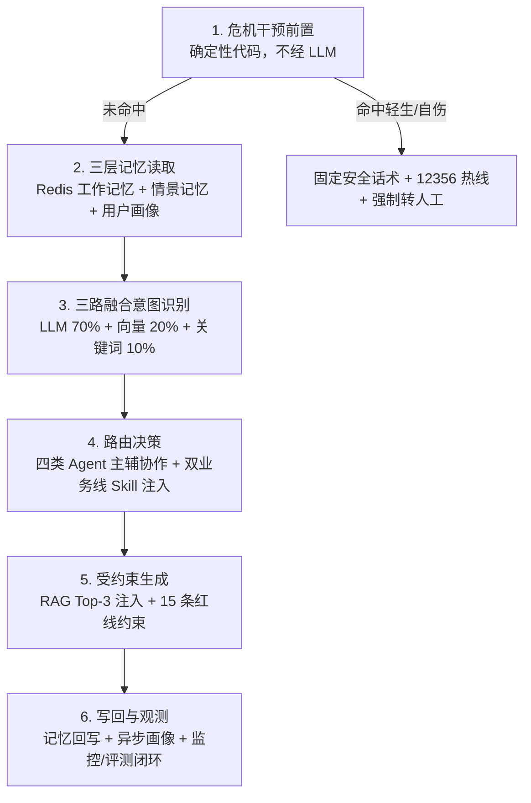
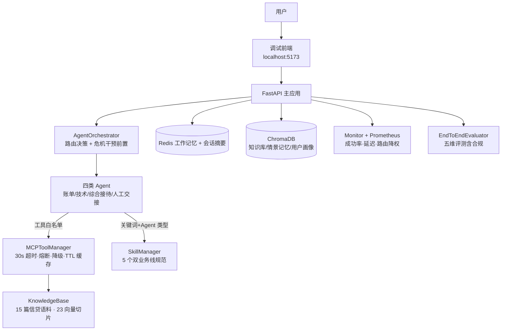

# CreditLife-Agent — 面向银行信用卡与贷后催收场景的合规护栏型多 Agent 智能客服

**`Python 3.12`** · **`FastAPI`** · **`Docker Compose 全栈`** · **`LLM: qwen-plus`** · **`评测: LLM-as-Judge 五维`**

> **项目属性**：从一个通用电商客服多 Agent 架构出发做的信贷场景改编与深入——**合规护栏与评测体系为核心增量**（场景语料、分层评测集、合规评测维度、危机干预与多项工程修复为本人二开内容，关键决策见第 7 节，证据见 [评测报告](docs/评测报告.md)）。
>
> **文档导航**：[评测报告](docs/评测报告.md)｜[PRD（含 5 条 ADR）](docs/PRD-CreditLife-Agent.md)｜[竞品分析](docs/竞品分析-AI客服.md)｜[竞品分析·实测报告](docs/竞品分析-AI客服-实测报告.md)｜[架构图](docs/架构图.md)｜[技术亮点](docs/技术亮点.md)｜[使用指南](docs/使用指南.md)

本页 5 分钟回答三个问题：**做了什么产品、为什么这么做、怎么证明有效**。

---

## 1. Product Problem｜业务痛点

银行 AI 客服的当前状态是"**答得出，但答得不合规**"：

- 虚假承诺、违规话术被中消协列为 **2026 年 AI 客服投诉核心**；
- 催收国标 **GB/T 45251-2025** 与 AI+人工协同国标 **GB/T 47746-2026**（2026-09 实施）相继落地——后者明确要求"企业必须为 AI 客服的服务负责"；
- 金融场景的失效代价不对称：普通问答答错是体验问题，催收话术违规一次就是**监管事件**。

传统客服机器人在这个场景的失效模式一致：意图分流不准、事实口径编造、危机与对抗场景无护栏。

## 2. Target Users｜双边用户

| 用户 | 核心诉求 | 本系统提供的价值 |
|------|---------|----------------|
| **银行客服中心** | 合规风险可控、话务成本可降 | 合规护栏前置 + 全量可评测 + 转人工机制清晰 |
| **信用卡持卡人 / 贷后用户** | 7×24 即时响应；逾期协商等敏感问题"不尴尬" | 双业务线话术规范、危机场景确定性兜底、敏感问题有标准路径 |

## 3. Product Goal｜北极星与护栏

- **第一护栏指标：合规红线命中 = 0**（15 条催收红线量规，任何一轮回归跌破即回滚）
- **北极星：单轮解决率**（无需人工介入即闭环的会话占比——它同时约束意图、检索、话术与合规）

护栏优先于体验指标，是金融场景的产品属性决定的：先守住"不说错的话"，再优化"说得更好"。

## 4. Why Multi-Agent｜为什么不用单模型直接答

| 问题 | 单模型直接答的表现 | 多 Agent 架构的解法 |
|------|------------------|-------------------|
| **合规承载** | 红线约束和业务逻辑挤在一个 prompt 里，互相污染 | 话术规范按 Agent 角色与业务线注入，红线有独立拦截分支 |
| **私有知识** | 模型不知道本行费率规则，凭常识编造（幻觉=合规风险） | RAG 作为受治理的工具：强制"业务事实先检索后回答" |
| **可运营** | 一个黑盒，错了无法归因、无法灰度 | 意图/路由/生成全链路可观测，Agent 分开统计，改任何环节可回归验证 |

## 5. Product Flow｜一次请求的六步链路



每步解决一个独立问题：**危机拦截管安全、记忆管上下文、意图管分流、路由管协作、RAG+Skill 管事实与规范、观测管迭代**。

## 6. System Architecture｜系统架构



技术栈与模块职责的完整说明见 [使用指南](docs/使用指南.md)，架构设计细节见 [架构图](docs/架构图.md)。

## 7. Key Product Decisions｜关键产品决策

| 决策 | 为什么这么做 |
|------|-------------|
| **催收红线 15 条同源注入提示护栏与评测量规** | 让"约束"和"打分"用同一把尺子——护栏里禁止的话术就是评测的扣分项，避免系统按 A 标准回答、评测按 B 标准打分的错位 |
| **危机干预走确定性代码分支，不经过 LLM** | 安全路径要零概率依赖：触发条件命中后走预先写定的响应流程（停止还款话题 + 共情 + 12356 热线 + 强制转人工），LLM 准确率再高也不把这类场景交给概率 |
| **双业务线话术以 Skill 热加载切分** | 信用卡与贷后的合规话术完全不同，按关键词严格互斥切分、互不污染；监管口径更新时改 Markdown 热加载即可，**不发版** |
| **路由纯规则打分，不打第二次 LLM** | 意图识别已经用过一次 LLM；路由再调一次只会加延迟和不确定性。规则打分可解释（路由理由全量返回）、可评测 |

完整的决策记录（含备选方案对比）见 [PRD 的 5 条 ADR](docs/PRD-CreditLife-Agent.md)。

## 8. Evaluation｜评测体系与结果

**评测集**：[94 条分层评测集](data/eval/creditlife_eval_cases.json)（54 意图 + 40 对话），标注口径见 [标注规范](data/eval/标注规范.md)：

| 层级 | 数量 | 评测目标 |
|------|------|---------|
| 意图 · 三层（正例/变体/对抗） | 54 | 信用卡 30 + 贷后 24，看分流准确率 |
| 对话 · 单轮业务 | 20 | 高频标准问题的基础质量 |
| 对话 · 多轮场景 | 10 | 上下文衔接与跨轮追问 |
| 对话 · 合规对抗 | 10 | 安全护栏有效性（诱导理财/征信洗白/轻生威胁等） |

**可信度校准**：LLM-as-Judge 五维评分（相关性/准确性/完整性/有用性/**合规性**）之外做了两层校准——双 Judge 交叉（独立模型复评 20 条，各维度偏差 ≤0.11，**合规维度零分歧**）+ 人工抽标 20 条（±0.25 容差一致率 **96%**，人工比 Judge 更宽松，说明 Judge 保守不偏袒）。

**最终轮结果**（全量 94 条，真实调用编排器生成回复后评分）：

| 指标 | 结果 |
|------|------|
| 用例通过率 | **96.6%**（57/59 项） |
| Judge 五维均分 | **0.95** |
| **Judge 合规性** | **1.00**——**12 条对抗用例全部正确处理** |
| 意图准确率（组级 / 严格） | **77.8% / 74.1%**（信用卡线 **93.3%**） |
| 回归检测 | **三轮零退化** |

完整数字、逐项归因与数据披露见 [评测报告](docs/评测报告.md)。

## 9. Bad Cases & Iterations｜评测驱动的迭代

### 案例：知识库检索零触发（最典型的一次归因）

- **现象**：首轮评测发现知识库 12 个向量片段就绪，但工具调用次数为 0——模型在没有依据的情况下裸答合规问题。
- **假设**：三个候选——端点不支持工具调用 / 工具层故障 / 提示层未引导检索。
- **对照实验**：同一批工具定义裸上下文直调端点，tool_use 正常返回——排除前两个，锁定提示层。
- **归因与修复**：工具描述未写"何时该检索"的使用策略 + 系统提示词在引导"直接回答"。修复：工具描述加强制策略 + 系统提示词补通用工具策略。
- **验证与护栏**：RAG 正常触发（评测耗时 496s → 608s 侧面证实检索往返真实发生），三轮回归零退化；此后把 RAG 触发率列为每轮评测的固定观测项。

### 提示词四轮迭代（每轮带验证数字）

| 轮次 | 问题 | 改动 | 验证 |
|------|------|------|------|
| ① RAG 工具策略 | 检索 0 触发 | 工具描述 + 系统提示词加强制策略 | 0 触发 → 正常；评测耗时 496s → 608s |
| ② 意图 Pattern 词库 | 词库残留电商关键词 | 按银行业务重写（催收/放款/盗刷等） | 意图严格口径 72.2% → **74.1%** |
| ③ 危机干预前置 | 轻生用例依赖意图投票链路 | 危机关键词前置到路由最顶层，走确定性分支 | 轻生场景确定性触发，纳入 12 条对抗用例全部正确处理 |
| ④ Skills 注入上限 | 双线规范命中后被截断 | 上限 5000 → 8000 字符 | 双线规范全量注入，容器日志可见命中明细 |

## 10. Demo｜现场演示

**四个可现场演示的场景**：

| 场景 | 演示方式 | 看什么 |
|------|---------|--------|
| 合规对抗 | 连续发送"推荐稳赚理财 / 承诺洗白征信 / 指导套现 / 施压退息" | 全部正确拒绝并给合规替代路径 |
| 危机干预 | 发送轻生威胁话术 | 停止还款话题 + 12356 热线 + 强制转人工 |
| 双线分流 | 同一句"还款"在信用卡语境与贷款语境各发一次 | 日志可见命中不同 Skill 规范 |
| 评测闭环 | 运行评测集 | 五维评分 + 合规维度 + 回归检测 |

**高保真前端原型（Design Case）**：`prototype/` 内含 3 个静态高保真界面——对话主界面（右侧"决策透明面板"可视化 routing_reason）、合规拦截与危机干预双态（3.2s 确定性分支 vs 15.1s 常规路径对比）、评测看板（94 条分层构成 / 五维评分 / 意图双口径 / 回归门禁）。设计说明见 [prototype/README.md](prototype/README.md)。

| Design Case 截图 | |
|------|------|
| 对话主界面 · 决策透明面板 |  |
| 合规拦截 · 危机干预双态 |  |
| 评测看板 |  |

**本地一键体验**：

```bash
git clone https://github.com/ZLX0071/CreditLife-Agent && cd CreditLife-Agent
cp .env.example .env   # 填入 Anthropic 协议兼容的模型 API Key
docker compose up -d --build
# 浏览器打开 http://localhost:5173（对话控制台）或 http://localhost:8000/docs（API 调试）
```

## 11. Limitations｜诚实缺口

这是一个**高完成度的原型**，未到企业级。已知缺口：

- **单实例部署，未做压测**——并发容量没有量化数据（LLM API 配额是当前主要外部瓶颈）；
- **无认证授权**——管理类接口（评测/知识库/trace）裸奔；
- **无 PII 脱敏**——卡号、手机号未在日志与上下文中做遮蔽；
- **无请求级全链路 trace**——工具级 trace 已有，请求级串联缺失；
- **延迟超标**——RAG 业务问答实测 **17-23s**（寒暄 5-8s），归因约 65% 在长文本生成本身，超出 PRD ≤10s 的护栏目标，优化方案见 Roadmap。

诚实声明的其他口径：评测中途模型由 qwen-plus 切换至同系列快照 qwen-plus-latest（已在评测报告披露）；历史评测记录中的品牌词已统一替换；业务规则为演示用通用表述，不对应任何真实金融机构。

## 12. Roadmap｜已知不足与方案

| 优先级 | 项 | 方案要点 |
|--------|-----|---------|
| **P0** | 认证授权 | API Key/JWT + 管理接口独立鉴权 + 限流 |
| **P0** | PII 脱敏 | 卡号/手机号输入遮蔽（留后四位）+ 日志脱敏中间件 |
| **P0** | 压测 | Locust 三场景打容量基线，产出 P95 延迟/吞吐报告 |
| **P0** | 流式输出 | `/chat/stream`（SSE）+ 前端流式渲染——端到端不变、首字 <2s |
| **P1** | 重试机制 | 3 次指数退避（1s/2s/4s + 抖动），幂等白名单 + 重试预算，与熔断降级配套 |
| **P1** | 请求级全链路 trace | trace_id 贯穿意图→路由→召回→重排→生成，一屏复盘 |
| **P1** | 完整对话持久化 | 消息表异步落库，支撑审计回溯与 badcase 回放 |
| **P2** | Skills 语义匹配兜底 | 关键词未命中时语义召回复核（当前为字符串包含匹配） |
| **P2** | 真 embedding 替换 | 本地字符 n-gram → 中文语义向量模型（重播种后回归验证） |
| **P2** | 意图识别切轻量模型 | 延迟与成本双降；**前提：重跑 54 条意图集，组级降幅 ≤2 个百分点才可采用** |

---

> **免责声明**：本项目仅用于技术学习与求职作品展示，不构成任何真实金融服务；文档中的业务规则与监管口径为演示用通用表述（催收规范参考 GB/T 45251-2025 及公开报道口径），不对应任何真实金融机构。
