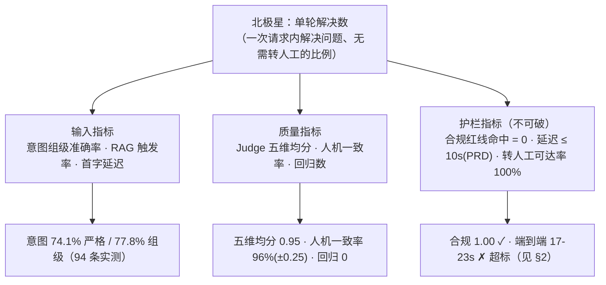

# CreditLife-Agent 指标体系与成本模型

> AI 产品经理的两门必修课：**延迟预算**（时间花在哪、该花多少）和**单位经济学**（一次对话值多少钱）。
> 本文所有实测数字来自 2026-09-27 本机 Docker 实测（单次采样，容器日志 httpx 时间戳归因）；成本为按公开牌价的量级估算，采购前以厂商最新牌价核对。

## 1. 指标树（北极星 → 输入 → 护栏）

北极星为什么是"单轮解决数"而不是"满意度"或"准确率"：客服产品的商业本质是**替代人工话务量**，一次没解决就等于一次失败的人工升级——它同时约束意图、检索、话术和合规，造假成本也最高（评测集里每条带 expected_behavior）。

## 2. 延迟预算表（实测归因 vs 目标）

**实测（2026-09-27，qwen-plus-latest，Docker 本机）：**

| 阶段 | 调用构成 | 实测耗时 | 占比 |
|------|---------|---------|------|
| 意图识别 | 1 次 LLM（小输出） | ~2s | ~10% |
| 路由 + Skills 注入 + 记忆读写 | 纯代码 + Redis | <0.5s | ~2% |
| RAG（命中时） | 改写 + 重排 2 次 LLM + 向量召回 | +4~8s | ~25% |
| **回复生成** | **1 次 LLM（长输出，500 字+ 结构化回答）** | **~15-17s** | **~65%** |
| 用户画像更新 | 1 次 LLM，**异步**，不阻塞响应 | 后台 ~4s | 0% |
| **端到端** | 无 RAG 2 次同步调用 / 有 RAG 4 次 | **实测 17s（应用内）/ 20-23s（客户端）** | — |

**归因结论：延迟大头是"生成阶段的长输出"，不是架构开销。** 500 字以上的分点长回答 = 上千输出 token 串行解码，这才是 65% 的来源；意图和路由都在预算内。

**对照 PRD 护栏（延迟 ≤ 10s）：当前超标，诚实记录。** 优化杠杆按性价比排序：

| 杠杆 | 预期收益 | 成本/风险 | 优先级 |
|------|---------|----------|--------|
| ① 流式输出（SSE） | 端到端不变，**首字 <2s**，感知延迟骤降 | 前端 fetch 改流式，改造小 | **P0** |
| ② 回答长度规范（Skill 约束"先结论、≤300 字、分点"） | 输出 token 减半 → 生成时间近半 | 改 SKILL.md 热加载即可，零代码风险；需重评测确认完整性维度不崩 | **P0** |
| ③ 意图与查询改写并行 / 高置信意图跳过重排 | -3~5s | 编排代码改动，需回归评测 | P1 |
| ④ 意图识别切 qwen-turbo | -1~2s + 该阶段成本降 ~60% | **74.1%/77.8% 意图数字绑定当前配置，采用前必须重跑 94 条评测** | P1 |
| 同义问句意图缓存 | 热点问题 <0.5s | 召回面控制不当会伤准确率 | P2 |

> 面试口径：先说归因（65% 在长输出生成），再说杠杆排序（先感知后真降），最后主动交代"④要重评测"——**任何降本/提速配置都不能以没有重新评测的数字为代价**。

## 3. 单位成本模型（一次对话多少钱）

**调用链构成（每条消息）：**

| 场景 | 同步 LLM 调用 | 异步 | 估算 token（进+出） |
|------|--------------|------|--------------------|
| 无 RAG（寒暄/澄清/转人工） | 意图 + 生成 = 2 | 画像 1 | ~3K + 1.5K |
| 有 RAG（业务问答） | 意图 + 改写 + 重排 + 生成 = 4 | 画像 1 | ~6K + 2K |
| 一条完整评测（94 条集） | 每条对话用例同上 + Judge 1 次 | — | 全集约 60-80 万 token |

**单次成本估算**（按 qwen-plus 公开牌价量级：输入 ~¥0.8/百万 token、输出 ~¥2/百万 token 估算）：

| 规模场景 | 日对话量 | 月成本量级 |
|---------|---------|-----------|
| 演示 / 面试 demo | ~100 条 | **<¥50/月** |
| 单支行试点 | 1 万条/日 | **~¥2-3 千/月** |
| 全量上线（对比人工） | 10 万条/日 | ~¥2-3 万/月 ≈ **十几个人力的话务成本** |

成本结构判断（面试可直接讲）：

1. **生成阶段同样是大头**（长输出 token 单价是输入的 ~2.5 倍）——延迟优化②（控输出长度）同时就是**降本优化**，一个动作两个收益；
2. **模型分层是最清晰的成本杠杆**：意图/改写/重排是"分类与排序"任务，qwen-turbo 量级足够（成本 ~1/3），生成保 qwen-plus；全链路统一降模型会砸质量，分层降不动核心体验；
3. **护栏指标本身就是成本指标**：合规事故一次的品牌/监管代价 >> 全年 token 成本，所以成本优化永远排在合规护栏之后——这是排序，不是权衡；
4. 转人工是隐性成本：每 1% 单轮解决率的提升 ≈ 直接省 1% 人工话务量——这就是北极星选"单轮解决数"的经济学理由。

## 4. 上线后的验证计划（AB）

- **流式 vs 非流式**：端到端延迟相同，假设流式组"等待放弃率"显著更低 → 验证感知延迟假设；
- **控长度 Skill**：对照组各跑 94 条评测，看完整性维度是否 ≥0.85 且延迟显著下降 → 验证"短答不伤质量"；
- **意图分层模型**：turbo 组重跑意图 54 条，组级准确率不低于 qwen-plus 组 2 个百分点才采用。

> 三条 AB 共用一个原则：**每一项优化先在评测集上过护栏，再上线上 AB**——评测闭环是所有迭代的前置门禁。
