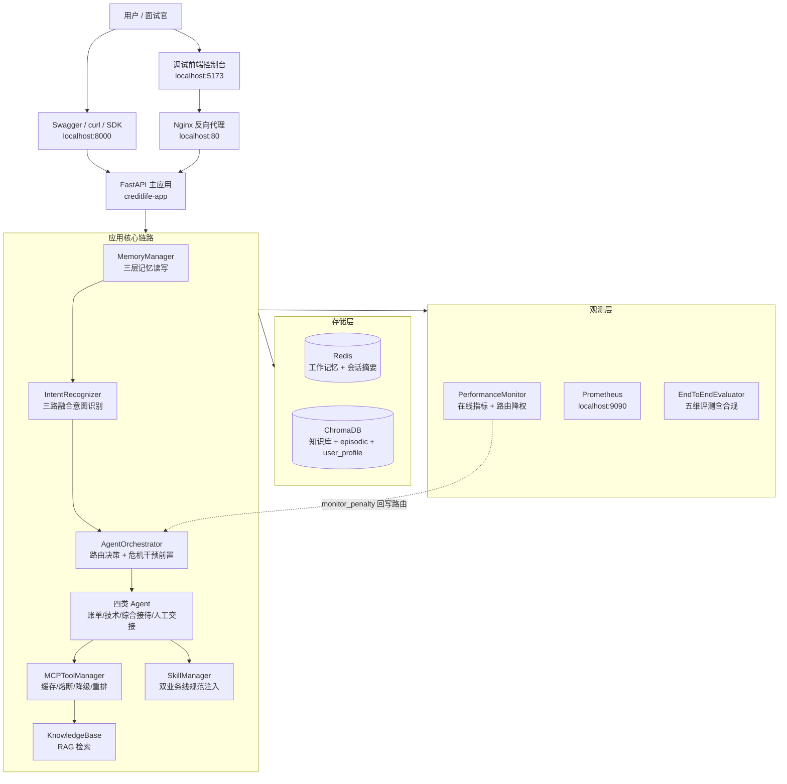
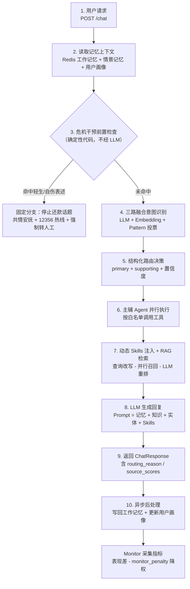
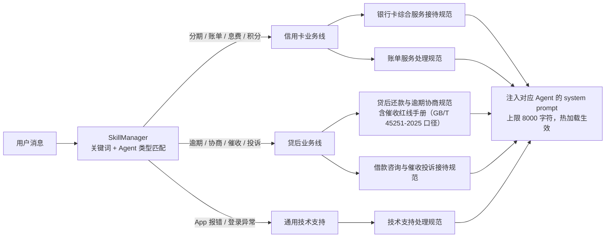
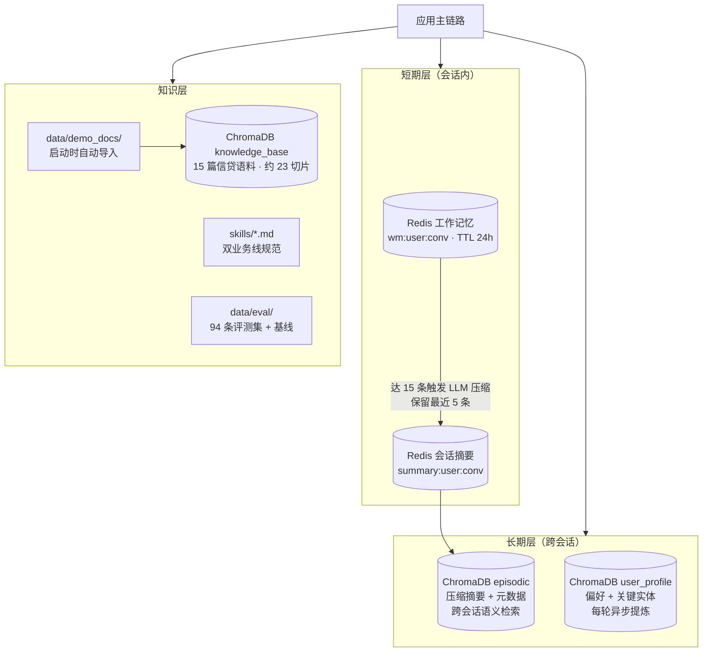
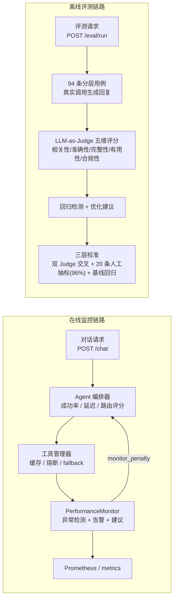

# CreditLife-Agent 架构图

> 使用 Mermaid 绘制，GitHub 原生渲染，随代码版本化维护。
> 配套阅读：[技术亮点](技术亮点.md)（每个设计解决什么问题）、[使用指南](使用指南.md)（怎么跑起来）。

## 1. 整体架构

## 2. /chat 主链路

## 3. 双业务线 Skill 注入

> 关键词在信用卡线与贷后线之间严格切分，同一句"还款"按上下文命中不同规范、互不污染。

## 4. 数据与存储架构

## 5. 监控与评测闭环

> 两条链路共同保证：路由不靠静态配置，评测不靠感觉——在线表现反哺路由选择，离线评测量化每一次迭代。
