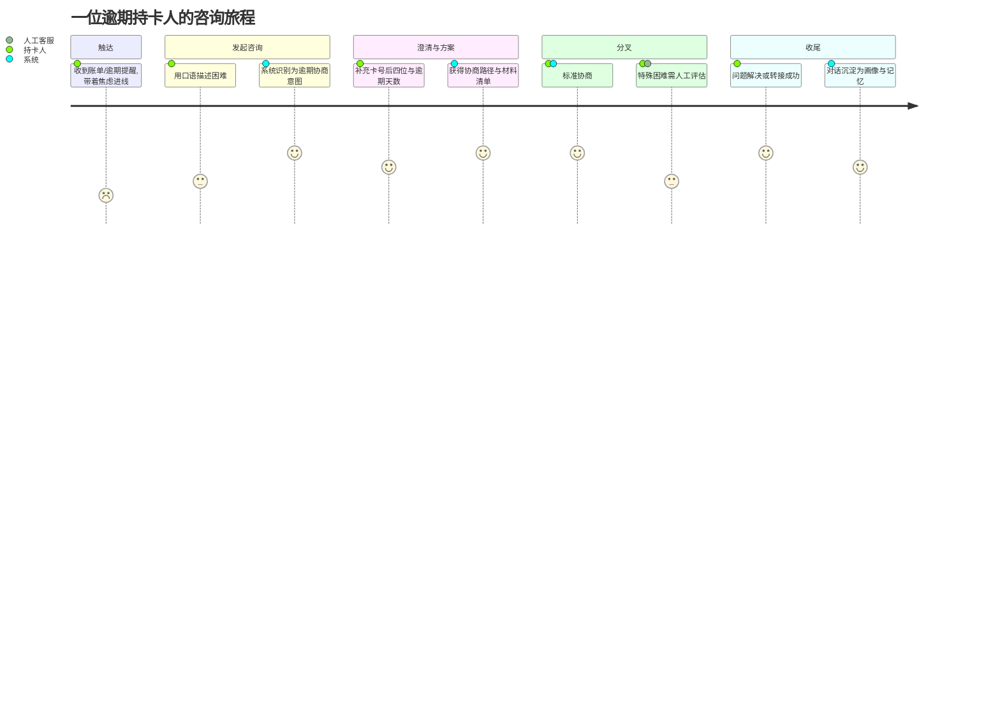
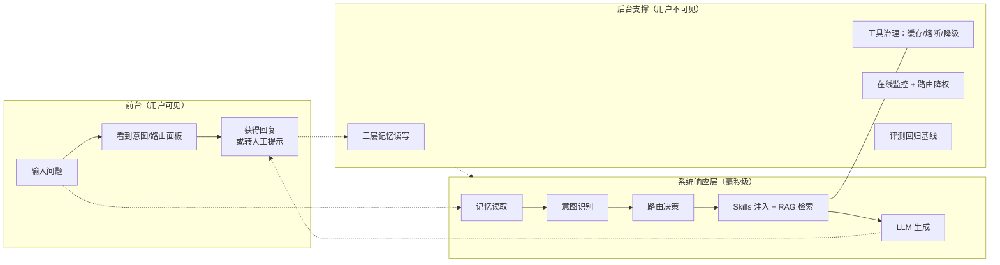
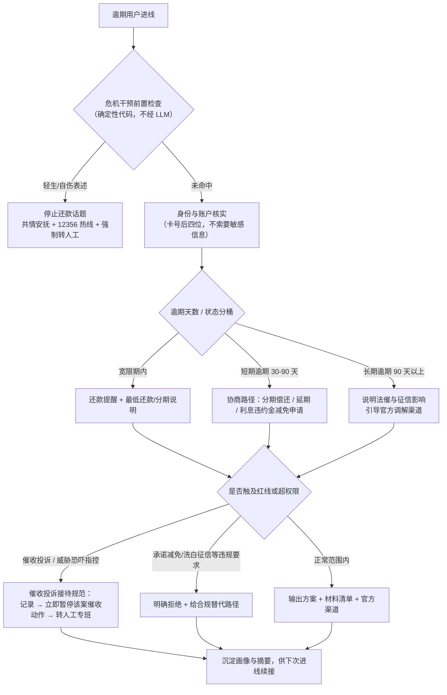
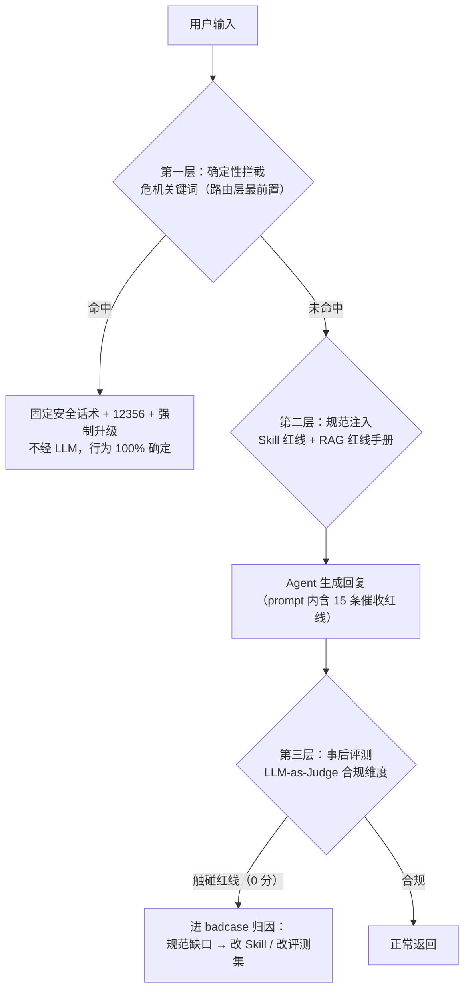
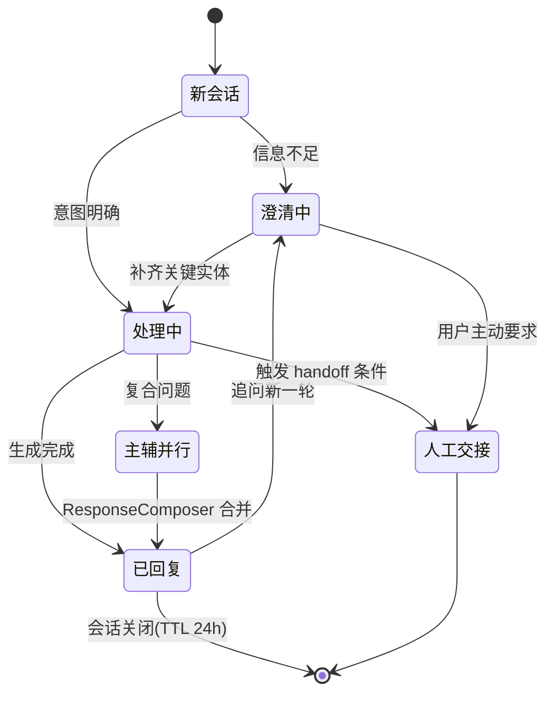
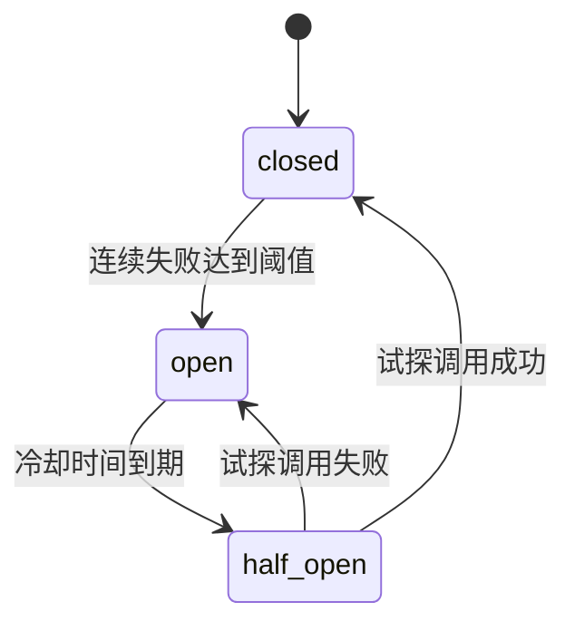

# CreditLife-Agent 用户旅程与业务流程

> 产品视角的流程资产：用户怎么用、系统怎么接、业务怎么流转、异常怎么兜底。
> 与 [架构图](架构图.md)（技术分层）互补——架构图回答"系统怎么组成"，本文回答"流程怎么走"。

## 1. 持卡人咨询旅程（User Journey）

旅程设计的两个产品判断：

- **情绪入口**：逾期用户进线时焦虑值最高，所以危机干预分支前置在路由最顶层（见 §3），先处理人、再处理事；
- **澄清成本**：结构化实体（卡号后四位/金额/天数）用规则抽取而非反复追问，减少一轮往返——每省一轮对话就是省一次 LLM 调用（见[指标体系与成本模型](指标体系与成本模型.md)）。

## 2. 服务蓝图（一次请求的前台与后台）

## 3. 贷后核心业务流程：逾期协商

红线口径（GB/T 45251-2025、中银协催收指引）作为 Skill 规范注入，**不写死在代码里**——监管口径更新时热加载即可。

## 4. 合规拦截流程（三层兜底）

设计原则：**安全关键路径用确定性代码，概率性风险用评测兜底**——LLM 再好也不把轻生场景交给概率模型；而话术类合规（措辞越界）无法穷举拦截，靠 15 条红线量规持续评测。

## 5. 会话状态机

## 6. 工具熔断器状态机

熔断的意义（对产品）：知识库抖动时用户拿到"降级回答 + 提示稍后再试"，而不是 30 秒超时白屏——**可用性优先于完整性**，这也是 Judge 完整性维度允许降级扣分而不算合规事故的原因。
