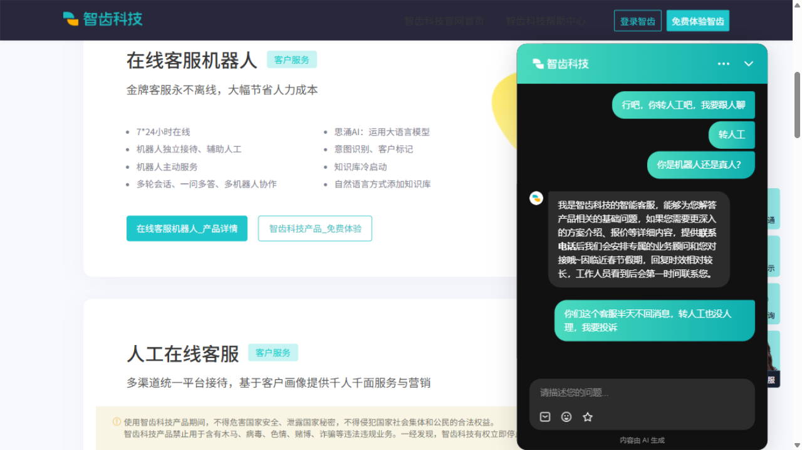
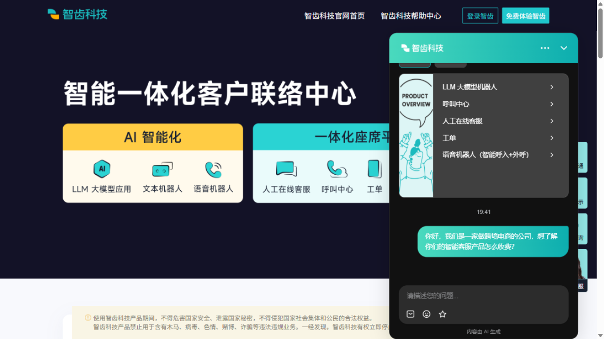
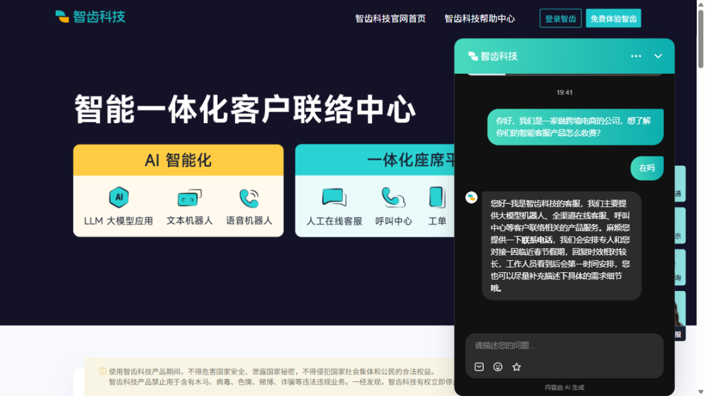
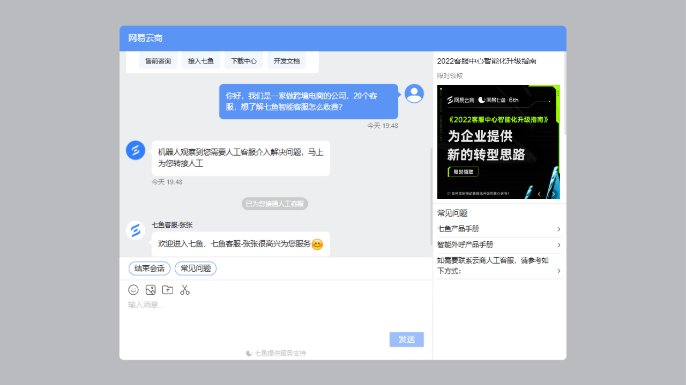
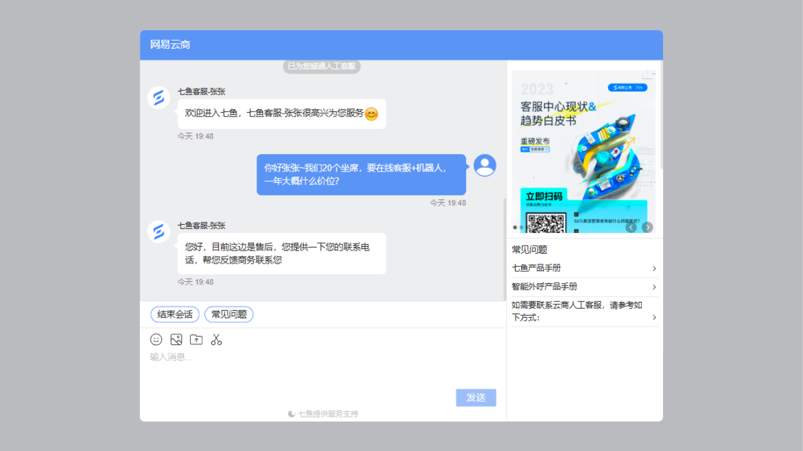
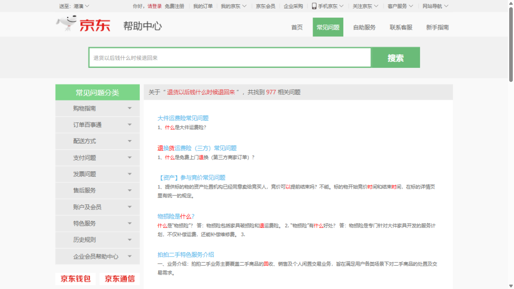
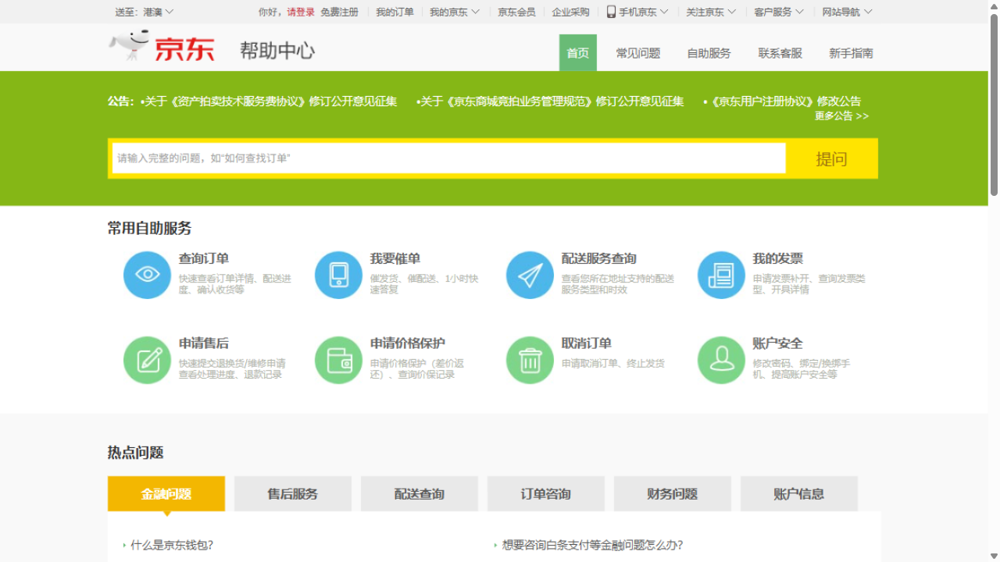

# AI 客服产品竞品分析报告：SaaS 型 vs 平台自用型（实测版）

> 作者：薛梓琏｜日期：2026-09-29（实测于当日 19:41–20:00）
> 方法：**真实对话实测**（网页端，以真实用户身份）+ 公开资料桌面研究。重实测、重判断，忌功能罗列。
> 关联：[CreditLife-Agent](https://github.com/ZLX0071/CreditLife-Agent)（[PRD](PRD-CreditLife-Agent.md)）；信贷场景的桌面研究版竞品分析见[《竞品分析-AI客服》](竞品分析-AI客服.md)，本篇是它的实测续篇。

---

## 0. 报告摘要

- **分析对象**：
  - **深拆**：智齿科技官网智能客服（"小智"）——国内独立 SaaS 客服厂商头部（IDC 2024 中国智能客服Top5 中唯一未被大厂收编的独立厂商之一），官网右下角挂的就是自家产品，可直接实测（dogfooding）；
  - **浅拆 A**：网易七鱼（网易云商）官网客服——网易系 SaaS 代表，与智齿同赛道、同入口形态，天然的对照实验；
  - **浅拆 B**：京东平台客服（网页端）——平台自用型代表，与"对外售卖"的 SaaS 型形成商业模式对照。
- **一句话结论**：**AI 客服的产品重心正在从"能不能答"转向"答不了时怎么办"——实测发现，头部厂商在《人工与智能客户服务协同》新国标生效（2026-09-01）28 天后，仍让用户的转人工请求三次石沉大海；这个行业最稀缺的不是更强的模型，而是把"降级路径"（转人工、兜底、知识库保鲜）当作一等公民来设计和评测的产品能力。**
- 分析人：薛梓琏｜2026-09-29

## 1. 我为什么做这个分析

**行业背景**：

- 中国智能客服市场规模 2022 年约 66.8 亿元，预计 2027 年达 181.3 亿元（公开行业研究口径）；大模型把"机器人味"对话升级为可用的意图理解，行业从"降本工具"走向"接待主力"。
- 但投诉同步爆发：中消协 2026 上半年分析显示，全国消协受理投诉 98.6 万件，售后服务类占 26.79% 居首，AI 客服被点名为三大新问题——**不实承诺、转人工困难、生成内容失准**（人民日报 2026-08-31《AI客服"转人工"难？"新国标"来了》）。
- 监管落地：**GB/T 47746-2026《顾客联络服务 人工与智能客户服务协同要求》2026-09-01 实施**，核心要求：人工入口要清晰、不能层层隐藏；简单问题交 AI、复杂问题转人工；企业为 AI 客服的服务负责。

**我带着的三个问题**（决定了这篇报告的深度）：

1. SaaS 厂商给**自己官网**配的机器人（dogfooding）是什么水平？从回答行为能看出它的意图理解靠规则还是模型？
2. 同一个"答不了"的问题（比如报价），SaaS 型和平台型分别怎么处理？**转人工的真实可达性**到底如何？
3. 新国标要求的"人工入口清晰、不能层层隐藏"，头部产品在国标生效后真的做到了吗？

## 2. 玩家图谱与产品定位

| 产品 | 公司 | 类型 | 目标客户 | 核心场景 | 部署方式 | 收费模式 |
|---|---|---|---|---|---|---|
| 智齿科技（在线客服+机器人，深拆） | 北京智齿博创科技有限公司 | SaaS | 中大型企业，覆盖零售/保险/医疗/教育/政府等 21 行业 | 在线客服、呼叫中心、工单、外呼、BPO | SaaS / PaaS / 本地化 | **无公开报价**，按坐席+模块组合，销售定制（本次实测确认） |
| 网易七鱼 / 网易云商（浅拆 A） | 网易 | SaaS | 电商、零售中小企业为主 | 售前接待+售后+外呼 | SaaS | 按坐席+版本；第三方选型口径标准版约 2000–6000 元/年/坐席，企业版定制 |
| 京东平台客服（浅拆 B） | 京东 | 平台自用 | 平台消费者 + 入驻商家 | 订单、物流、售后、价保、发票 | 自建 | 消费者免费（商家侧另有产品） |
| Intercom Fin（参照系，未实测） | Intercom | SaaS（海外标杆） | 全球中小企业 | 客服自动化 | SaaS | **按结果计费**：$0.99/次有效解决 + 坐席费 $29–132/月 |

**定位描述**：

- **智齿科技**：一体化客户联络中心厂商，产品线覆盖文本机器人、在线客服、呼叫中心、工单、外呼、BPO，卖的是"一个供应商解决所有联络场景"。7 年 7 轮融资累计超 10 亿元（红杉、腾讯、IDG 等），2022 年 2 月 D 轮。官网自己用自家机器人接待售前咨询，是标准 dogfooding 样本。
- **网易七鱼**：网易智企旗下客服产品，依托网易背书主打电商零售，产品思路偏"开箱即用"，售前机器人+人工协作是主打卖点。
- **京东客服**：平台自用型的最大样本之一——不卖软件，客服体验直接服务平台交易信任。入口与账号体系深度绑定。

## 3. 深度拆解：智齿科技官网智能客服（全报告重心）

### 3.1 实测记录（最重要的部分）

**实测方法**：2026-09-29 19:41 起，以真实访客身份在 sobot.com 官网右下角"在线客服"入口发起对话，共 **9 轮**，覆盖场景：售前咨询（报价）、竞品对比、多轮记忆、模糊追问、转人工、身份闲聊、投诉。界面右下角带"内容由 AI 生成"标识。

> ⚠️ **方法局限（诚实声明）**：我测的是**厂商给自己官网配置的接待机器人**。它反映厂商自家产品在其熟悉场景上的配置与运营水平，**不等于**其客户侧（电商、保险等）的实际效果；但 dogfooding 恰恰暴露的是"厂商认为好的配置长什么样"，参考价值真实存在。

| 轮次 | 我说的 | 它的反应 | 说明什么 |
|---|---|---|---|
| R1 | 自我介绍跨境电商公司，问智能客服怎么收费 | **完全静默，约 1 分钟无任何响应** | 首问失败，无兜底确认 |
| R2 | "在吗" | 回复产品线简介 + **索要联系电话** + "因**临近春节假期**，回复时效相对较长" | 需要短消息"唤醒"；兜底话术是**过期的节假日配置**（当时是 9 月底） |
| R3 | 拒绝留电话，追问 20 坐席一年费用量级 | "非常抱歉，目前没有相关的费用公开信息，价格会根据产品组合、功能模块、坐席授权时长等因素有所不同" + 再次要电话，并称安排"**熟悉跨境电商行业的专人**" | **知识边界诚实**：不编造价格；**同时暴露它记住了 R1 的行业信息** |
| R4 | "你还记得我们公司是做什么行业的吗？" | "您之前提到是跨境电商行业的哦~" 但下方**叠加了一条**"非常抱歉，我暂时没有这个问题的答案" | 会话级记忆**通过**；但两条自相矛盾的回复同时出现，通道一致性差 |
| R5 | 和网易七鱼比有什么优势？ | 结构化列 3 点（一体化服务/全球化支持/大模型技术成熟），**全程未点名竞品**，末尾照例要电话+春节话术 | 竞品问题安全应答，不贬低不对比，是训练/知识库的双重约束 |
| R6 | "行吧，你转人工吧，我要跟人聊" | **静默，20 秒+无响应** | 口语化转人工意图丢失 |
| R7 | "转人工"（精确关键词） | **仍然静默** | 转人工意图**配置缺失**，不是理解问题 |
| R8 | "你是机器人还是真人？" | 诚实回答"我是智齿科技的智能客服，能解答产品基础问题……" + 要电话 + 春节话术 | 身份披露诚实（合规加分） |
| R9 | "你们这个客服半天不回消息，转人工也没人理，我要投诉" | **静默**（发出后石沉大海） | 投诉情绪同样无兜底 |

**关键发现（全部为实测所得）**：

1. **转人工请求 3 次静默（R6/R7/R9）**——包括精确关键词"转人工"。没有排队提示、没有留言表单、没有响应时长承诺，任何反馈都没有。这发生在 **GB/T 47746-2026 生效后的第 28 天**，而该标准的原文要求恰恰是"人工入口要清晰，不能层层隐藏"。
2. **兜底话术带"过期炸弹"**："因临近春节假期，回复时效相对较长"在 9 月底出现了 **5 次**——这是一条写死的节假日兜底配置，过了春节没人下线它。卖知识库的厂商，自己的知识库过期了 7 个月。
3. **首问静默**：R1 的完整咨询无任何响应，短消息"在吗"才触发回复——对高意向长首问反而丢弃，线索漏斗第一环就在漏。
4. **知识边界诚实，编造抑制好**：全程没有编造价格、没有贬低竞品、没有谎称真人。大模型时代"敢不敢答"让位于"该不该答"，这点做到了。
5. **会话级记忆可用**：R1 埋的行业钩子（跨境电商）在 R3、R4 被自然调用（"安排熟悉跨境电商行业的专人"）——上下文窗口在用，但和兜底模板的拼接生硬（R4 的双回复矛盾）。

### 3.2 核心机制推断（对照多 Agent 客服的通用框架）

- **意图理解与路由**：行为证据显示**意图识别与动作执行是分离的两层**。"报价"意图稳定命中并触发"线索收集"动作（5 次索要电话，话术还带个性化）——说明意图→动作的管道是通的；而"转人工"意图**没有任何绑定动作**，更像是配置缺失而非理解失败（精确关键词也静默）。推断它的架构是"意图识别 → 意图动作表/知识库 → LLM 兜底生成"，转人工压根不在动作表里。
- **知识库 / RAG**：R5 的竞品答案是结构化知识条目（固定 3 点、无生成痕迹）；R3 的"没有公开费用信息"是诚实的知识边界声明。**知识没覆盖时的表现=配置的兜底文案**，而这条兜底文案过期了——说明知识库有"运营生命周期"却无"过期机制"。
- **多轮对话与记忆**：R3/R4 证明会话级上下文有效（跨 3 轮调用行业信息）；但 R4 出现"记忆调用成功 + 无答案兜底"两条回复叠加，推断 FAQ/知识库通道与 LLM 通道**并行独立**，缺一层输出一致性仲裁。
- **转人工与降级**：实测**不可达**。无排队信息、无留言表单、无时间承诺。对照官网产品页"7*24小时在线""机器人独立接待、辅助人工"的宣传（见截图背景），落差本身就是发现：**宣传的是接待能力，缺的是降级能力**。
- **透明度合规**：窗口右下角常驻"内容由 AI 生成"标识——GB/T 47746 的透明度要求做到了，这一项比很多 C 端产品好。
- **效果与口碑**：公开渠道未见其独立解决率数据；行业层面，中消协 2026H1 点名的"转人工困难"在本例中得到直接印证——头部厂商官网自身即样本。

### 3.3 商业模式

- **谁付费、怎么计费**：企业客户按坐席数 + 功能模块 + 部署方式（SaaS/PaaS/私有化）组合计费。**无公开报价**（本次实测向机器人直接确认："目前没有相关的费用公开信息"）。
- **AI 能力怎么定价**：公开渠道不可见，从话术看是"整体解决方案报价"而非按对话量/按解决计费——与海外 Intercom Fin 的 **$0.99/次有效解决**（按结果付费）形成鲜明代际差：国内按投入（坐席）计费，海外按产出（解决）计费。按结果计费把"机器人不行"的成本留给厂商自己，是更强的产品自证机制。
- **它的客户为什么买单**：一体化（软件+线路+外包人力）+ 头部案例背书。销售依赖"留电话→商务对接"的线索漏斗——**报价本身就是销售资产，不是知识资产**，机器人不给价格是刻意设计。但正因如此，漏斗第一环（对高意向访客的首次响应）静默，才是纯粹的执行事故：**策略没错，落地漏了**。

## 4. 浅拆对比

### 4.1 网易七鱼（网易云商）——同一个问题，相反的哲学

- **同一个报价问题**（R1 相同话术）：机器人立刻回复"**机器人观察到您需要人工客服介入解决问题，马上为您转接人工**"，系统提示"已为您转接人工客服"，**约 5 秒内真人坐席（七鱼客服-张张）接入问候**。机器人对"收费"类意图的第一策略是**不接、直接转**——与智齿"机器人答但答不出数"完全相反。
- **但转人工 ≠ 解决问题**：真人坐席第一句自我定位是"目前这边是**售后**"，报价同样要"提供一下您的联系电话，帮您反馈商务联系您"。也就是说：七鱼解决了**转人工的可达性**（秒级可达），没解决**人对口**（售前问题转到的第一线是售后岗）。国标管"入口清晰"，不管"分派正确"——后者是下一阶段的体验分水岭。
- **人工入口前置**：页面侧栏直接展示"如需要联系云商人工客服，请参考如下方式"——人工路径在进入对话前就可见，合规姿态比智齿好。
- **内容陈旧问题同款**：官网首屏轮播的还是《2022 客服中心智能化升级指南》《2023 客服中心现状&趋势白皮书》——和智齿的过期春节话术互为镜像（见 §5 洞察 3）。
- **定价**：第三方选型口径标准版约 2000–6000 元/年/坐席，按版本+坐席计费，相对透明；智齿完全黑箱。

### 4.2 京东平台客服（网页端）——登录墙后的 AI

- **未登录用户体验**（实测）：帮助中心顶部的"提问"框**不是 AI 客服，是 FAQ 关键词检索**——输入"退货以后钱什么时候退回来"，返回"共找到 **977** 个相关问题"，前几条是大件运费险、退换货运费险、拍卖参与竞价的说明，**与退款到账时间无一相关**。且 URL 里的关键词编码显示为乱码（GBK 编码问题），检索相关性也没有做语义层。
- **在线客服入口**（实测）：chat.jd.com 直接 302 到 passport.jd.com 登录页——**对话能力在登录墙后**。对照 SaaS 厂商官网"进页面就能聊"，平台自用型把客服当作"账号体系内的会员服务"：它默认你带着订单来，不服务"路人咨询"。
- **App 内行为**（公开资料口径，未实测）：人民日报 2026-08 报道的典型投诉——消费者在电商平台被 AI 客服"承诺补偿优惠券、24 小时内到账"，到期未发放，且人工难寻；黑猫投诉上"AI 外呼骚扰""转人工难"是平台型客服的高频主题。这与中消协点名的"不实承诺、转人工困难"完全对应。
- **判断**：平台型的 AI 客服 KPI 是**降本与拦截**（ deflect rate），而非线索转化；它的合规风险集中在"承诺类"生成内容（优惠券/到账时间），这与 SaaS 型（报价不承诺）的风险点结构不同——**平台型管承诺，SaaS 型管报价，都不承诺是共性**。

## 5. 横向对比与关键发现

**能力对比表**（实测 + 公开资料，★ 为本次实测验证）：

| 维度 | 智齿科技（深拆） | 网易七鱼 | 京东平台客服 |
|---|---|---|---|
| 意图理解★ | 报价/竞品/身份命中，转人工意图无动作 | 售前意图识别后**主动转人工** | 未登录仅关键词检索，无语义层 |
| 知识问答★ | 边界诚实不编造，但兜底话术过期 7 个月 | 机器人不首答报价类 | FAQ 检索相关性差（977 条不对题） |
| 多轮记忆★ | 会话级记忆可用（跨 3 轮调用行业信息） | 未测（直接进人工会话） | — |
| 转人工体验★ | **3 次静默，不可达（国标生效后）** | 秒级可达，但第一线分派不准 | 登录墙 + 电话客服兜底 |
| 多渠道 | 官网/APP/小程序/公众号/WhatsApp | 全渠道 + 网易系生态 | 平台内闭环（APP/网页强制登录） |
| 计费模式 | 黑箱（坐席+模块，销售定制） | 半透明（版本+坐席） | 免费（平台成本中心） |
| 内容运营★ | 过期春节话术出现 5 次 | 2022/2023 白皮书仍在首屏 | 帮助中心内容量大但检索弱 |

**五条洞察（现象 + 为什么）**：

1. **同一个"报价"问题，三家给出三种"答不了"**：智齿"机器人答但不给数"、七鱼"识别后直接转人工"、京东"先登录再说"。为什么？报价对 SaaS 厂商是**销售资产**（线索漏斗入口），对平台型是**无关信息**（它不卖软件）。"答不了时的策略"比"能答时的质量"更能暴露产品的商业模型——这是选品实测能测出来、看官网介绍测不出来的东西。
2. **转人工是全行业合规红线，也是能力洼地**：国标 9 月 1 日生效，9 月 29 日头部厂商官网仍然转人工三次静默。为什么"入口清晰"写了标准还做不到？因为国标管的是**可达性**（能不能找到入口），而真实体验的断层在**响应性**（请求了有没有回音）和**分派正确性**（转到了是不是对口的人，七鱼反例）——这三层只有第一层被写进标准，后两层是接下来一年的产品机会，也是监管随访的方向。
3. **dogfooding 揭示"知识库保鲜"是行业性未解难题**：卖客服知识库的智齿，自家兜底话术过期 7 个月复读 5 遍；网易系官网挂着 3 年前的白皮书。为什么？知识库运营是**人力密集的持续运营**，厂商自己的内容团队尚且顾不过来，客户的运营水平只会更差。谁把"内容有效期、自动过期、运营待办"做成产品能力（而不是 Excel 台账），谁就切中了一个全行业的高频痛点——这比"机器人更会聊"的军备竞赛务实得多。
4. **编造抑制已成为行业基线**：全程没有任何一家编造价格、编造政策、贬低竞品（京东的"承诺优惠券"是反例，来自公开投诉口径）。大模型落地三年后，"幻觉治理"在头部场景的优先级已被"降级路径设计"取代——行业竞争从"别胡说"进入"别沉默"阶段。
5. **反例（做得糙的地方）**：智齿 R4 出现两条自相矛盾的回复叠加（"您之前提到是跨境电商"与"我暂时没有这个问题的答案"同屏）。这暴露 FAQ 通道与 LLM 通道并行输出、无一致性仲裁的架构债——是工程取舍（快速接两条管道）还是资源问题（没人管输出合并），从外部不可知，但无论哪种，用户感知都是"这个客服精神分裂"。

## 6. 如果我是这个产品的 PM（面试官最想看的一页）

以智齿官网客服为对象——因为它的问题全部来自我的实测，不凭空提。

- **我发现的问题/机会**（按严重度排序）：
  1. 转人工请求 3 次静默（含精确关键词）——高意向访客的直接流失 + 国标合规风险；
  2. 首问静默——线索漏斗第一环断裂；
  3. 兜底话术过期 7 个月复读 5 次——厂商自身知识库运营失控的活证据。
- **下一个版本我会做什么**（具体到交互）：
  1. **"人工保障位"**：任何轮次命中转人工意图（含口语变体），3 秒内**必有**结构化响应——人工在线：显示"当前排队第 N 位，预计等待 X 分钟"+ 排队中可继续与机器人聊；人工离线：展开留言表单（手机号 + 期望回拨时间段），提交后即时回显"已登记，工作时间内 X 小时回电"。**原则：转人工可以慢，但不可以没回音。**
  2. **话术有效期机制**：节假日公告、促销话术等带时效的兜底文案，配置时强制填 `有效期至`，到期自动下线并生成运营待办；对"30 天未命中且未更新"的兜底话术自动标记"疑似过期"提醒复核。
  3. （顺手修）**首问确认**：任何用户消息 5 秒内至少返回一条确认性响应（"已收到，正在为您查询"），杜绝静默。
- **为什么**：
  - 用户价值：降级路径**可预期**是信任的底座——用户可以接受等，不能接受喊了没人应；
  - 商业价值：官网访客是厂商最贵的流量（主动来询价），转人工静默=高意向线索直接蒸发；保障位把"沉默流失"变"留言留存"，直接影响线索转化率；同时消除新国标下的合规暴露面。
- **怎么验证**（这一段让分析变成产品判断）：
  - **指标**：转人工请求响应率（目标 100%）、转人工首响时长 P50（<5s）、会话放弃率（下降）、访客留资率（不降）；
  - **A/B**：50% 流量开启"人工保障位"，跑 2 周；
  - **预期**：转人工静默归零；会话放弃率下降；留资率持平或上升——若留资率下降，说明兜底形态打扰了纯浏览用户，需加入口频控而非回滚；
  - **进阶**：把"转人工可达性、兜底时效、双通道输出一致性"做成**上线前回归评测集**（10–20 条对抗用例，每次发版自动跑）——这正是我在 [CreditLife-Agent](https://github.com/ZLX0071/CreditLife-Agent) 里用 94 例评测集 + 12 条对抗用例做合规回归的同一套方法，从信贷 Agent 平移到客服 Agent 零成本。

## 7. 附录

### 7.1 实测截图

| # | 截图 | 说明 |
|---|---|---|
| 1 | [01-sobot-widget-open](assets/competitive-analysis/01-sobot-widget-open.png) | 智齿官网客服窗口（自家产品 dogfooding，带"内容由 AI 生成"标识） |
| 2 | [02-sobot-first-msg-ignored](assets/competitive-analysis/02-sobot-first-msg-ignored.png) | 首问静默，"在吗"唤醒后的回复：索要电话 + 过期春节话术 |
| 3 | [03-sobot-pricing-phone-wall](assets/competitive-analysis/03-sobot-pricing-phone-wall.png) | 承认无公开报价（不编造），个性化提到"跨境电商专人"，仍复读过期话术 |
| 4 | [04-sobot-handoff-silence](assets/competitive-analysis/04-sobot-handoff-silence.png) | "转人工"消息发出后无任何响应 |
| 5 | [05-sobot-handoff-complaint-silence](assets/competitive-analysis/05-sobot-handoff-complaint-silence.png) | 一帧看全：转人工×2 无响应 + 投诉石沉大海，背景是官网"7*24小时在线"标语 |
| 6 | [06-qiyukf-auto-handoff](assets/competitive-analysis/06-qiyukf-auto-handoff.png) | 七鱼：同一报价问题，机器人秒判"需人工介入"，5 秒转真人 |
| 7 | [07-qiyukf-human-phone-ask](assets/competitive-analysis/07-qiyukf-human-phone-ask.png) | 七鱼真人坐席：第一线为售后岗，报价仍要电话转商务 |
| 8 | [08-jd-help-faq-search](assets/competitive-analysis/08-jd-help-faq-search.png) | 京东帮助中心（未登录）：提问框实为 FAQ 检索，退款问题返回 977 条不相关结果 |
| 9 | [09-jd-help-notlogin](assets/competitive-analysis/09-jd-help-notlogin.png) | 京东帮助中心首页：自助服务矩阵，在线客服入口在登录墙后 |

### 7.2 方法与局限

- 实测时间：2026-09-29 19:41–20:00（北京时间晚间）；入口均为网页端公开入口，未使用任何登录态，未留真实个人信息。
- 局限 1：SaaS 两家测的是**厂商自有官网机器人**（dogfooding 配置），不代表其客户侧效果；
- 局限 2：京东仅覆盖**未登录网页端**路径，App 内 AI 客服行为引自公开报道，未实测；
- 局限 3：单次会话样本，意图边界、并发排队等结论需更大样本验证。

### 7.3 参考资料

- 人民日报（2026-08-31 / 09-02）：《AI客服"转人工"难？"新国标"来了》《人工与智能客服协同新标准 9 月 1 日起实施》—— GB/T 47746-2026 报道
- 中消协 2026 年上半年投诉分析（媒体转引）：受理投诉 98.6 万件，售后类占 26.79%，AI 客服三大问题
- IDC 中国智能客服市场份额（2024）：阿里云、百度智能云、容联七陌、中关村科金、智齿科技为 Top5
- 智齿科技融资信息：7 年 7 轮累计超 10 亿元，2022-02 D 轮（公开报道）
- 网易七鱼价格：第三方选型指南口径（标准版约 2000–6000 元/年/坐席），实际以官方报价为准
- Intercom Fin 定价：$0.99/resolution + 坐席 $29–132/月（官网及第三方评测口径）
- 行业规模：中国智能客服市场 2022 年 66.8 亿元、2027E 181.3 亿元（公开行业研究）
