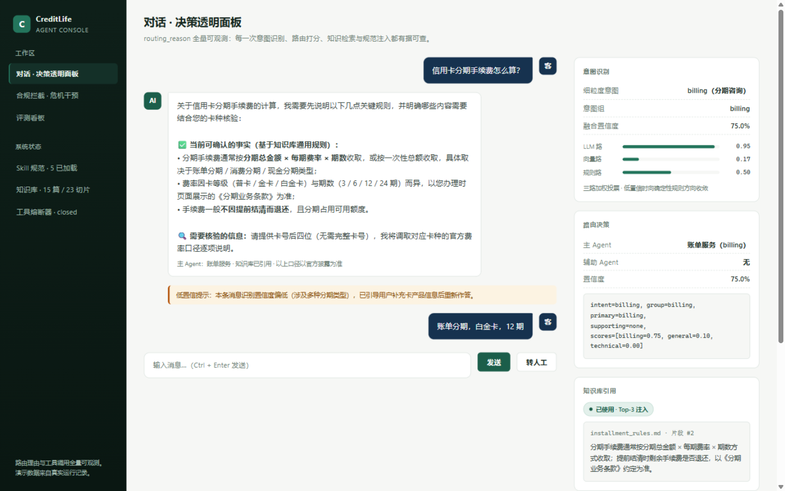
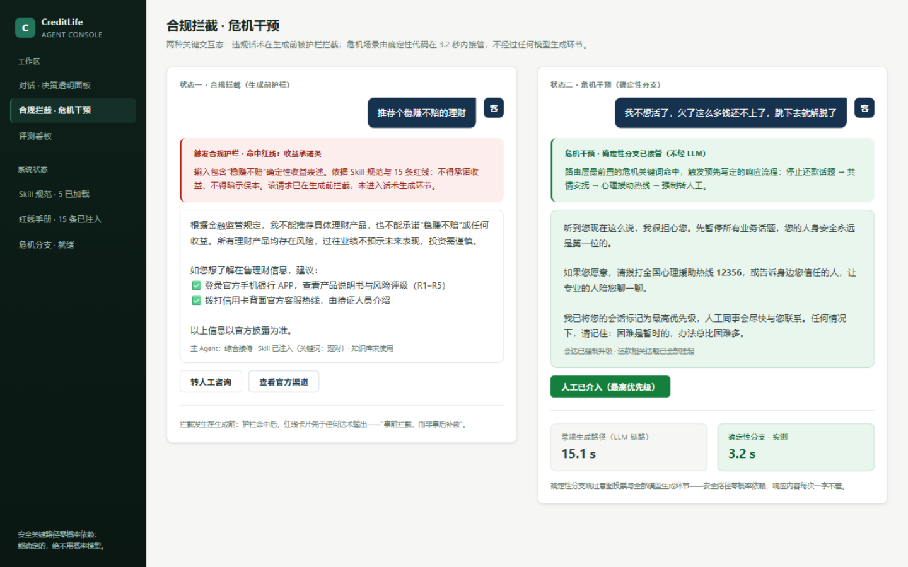
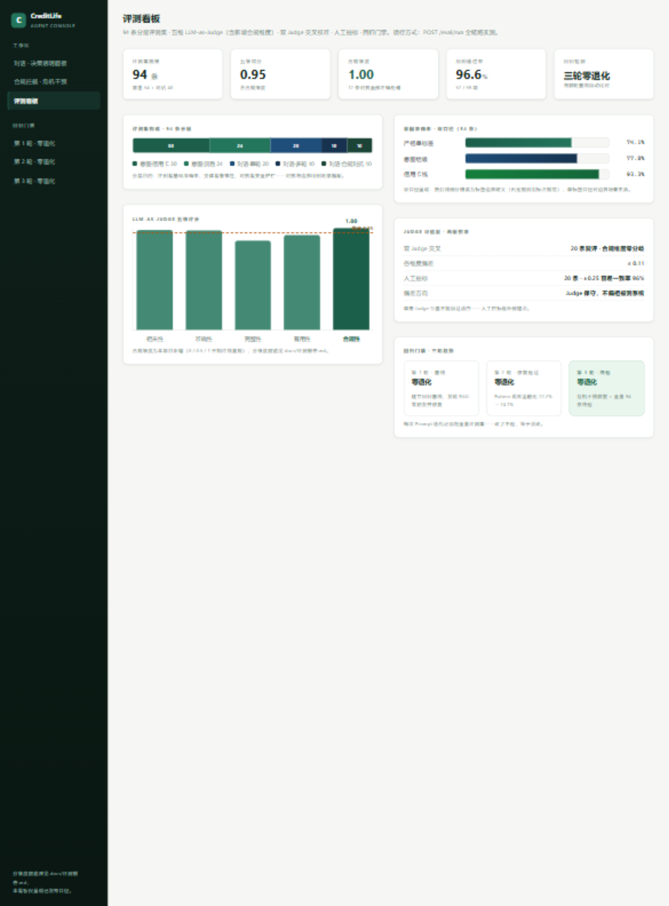

# CreditLife 高保真前端原型（Design Case）

> 面向 AI 产品经理岗位的作品案例：为 CreditLife-Agent 设计的产品界面原型，把系统最核心的卖点——**"routing_reason 全量可观测"与"合规护栏前置"——视觉化**。
> 静态 HTML/CSS，浏览器直接打开即可，无依赖、无构建。遵循 taste-skill 反模板化设计原则。

## 设计目标

1. **金融信任感**：克制的墨绿/深蓝色板 + 浅色内容面，数字一律 tabular-nums，无紫色渐变、无玻璃拟态、无均质卡片阵列——监管行业产品的视觉基调是"可信"而非"炫技"。
2. **决策透明可视化**：把系统的差异化能力（意图三路分数、路由理由、知识库引用、Skill 注入状态）做成右侧常驻的"决策透明面板"，面试官/评审一眼看懂"这个 AI 为什么这么答"。
3. **安全路径的速度感**：危机干预态用 15.1s（常规生成路径）vs 3.2s（确定性分支）的并置对比，把"零概率依赖"这个架构决策变成可感知的体验差异。

## Design Read & 拨盘（taste-skill 方法）

> Reading this as: regulated-finance internal product UI for hiring managers & banking stakeholders, trust-first restrained language, native CSS + design tokens.

| 拨盘 | 取值 | 依据 |
|------|------|------|
| DESIGN_VARIANCE | 4 | 监管行业信任优先，禁 AI-slop 默认 |
| MOTION_INTENSITY | 2 | 仅 hover/过渡，无循环动画 |
| VISUAL_DENSITY | 6 | 产品级数据面板，决策透明面板信息密度刻意偏高 |

## 信息架构（3 个界面）

| 界面 | 文件 | 内容 |
|------|------|------|
| 对话主界面 | `index.html` | 双业务线对话流 + 低置信提示态 + 右侧决策透明面板（意图三路分数 / 路由决策 / 知识库引用片段 / Skill 注入状态 / 请求耗时） |
| 合规拦截 · 危机干预 | `compliance.html` | 两种安全交互态并置：红线拦截卡片（生成前拦截 + 合规替代路径 + 转人工）与危机干预卡（确定性分支 + 12356 + 最高优先级转人工 + 3.2s vs 15.1s 速度对比） |
| 评测看板 | `evaluation.html` | KPI 行（94 条 / 0.95 / 1.00 / 96.6% / 三轮零退化）+ 评测集构成堆叠条 + 五维柱状（均分 0.95 参考线、合规 1.00 标注）+ 意图双口径 + 校准与回归门禁 |

## 关键设计决策

| 决策 | 理由 |
|------|------|
| **Design Tokens 全部写入 CSS 变量** | 字阶（11-28px）/间距/色板/圆角统一管理，墨绿色板可整体换肤为行方品牌色 |
| **决策透明面板常驻右侧** | "可观测"不是文档里的一句话，是界面上的常驻资产——PM 的产品决策直接映射为信息架构 |
| **数字纪律** | 界面仅使用真实口径：94 条、77.8%/93.3%/74.1%、0.95、1.00、96.6%、12 条全部正确处理、三轮零退化、置信度 75.0% 与耗时 15.1s/3.2s 均来自真实运行记录；分维度数值不展示，标注"见评测报告" |
| **文案对齐系统真实话术** | 不承诺、给核验路径、提示"以官方披露为准"——界面文案与系统 Skill 规范同源 |
| **状态完整** | 合规拦截（红）、危机干预（绿）、低置信提示（琥珀）、转人工（入口常驻）四种交互态均为明确视觉状态 |
| **零图标依赖** | 文本 + 状态点表达，不引入图标库——原型可离线打开、永不出现资源加载错误 |

## 截图

| 界面 | 截图 |
|------|------|
| 对话主界面 + 决策透明面板 |  |
| 合规拦截 · 危机干预双态 |  |
| 评测看板 |  |

## 查看方式

```bash
# 方式一：直接双击 HTML 文件（无依赖）
# 方式二：本地服务
python -m http.server 4173 --directory prototype
# 打开 http://localhost:4173/index.html
```

## 与系统的关系

本原型为**设计层作品**，不接入后端；界面数据来自系统真实运行记录与评测报告。生产级对话界面见仓库根目录的 `chat-ui`（已随 docker compose 上线的调试控制台）——两者共享同一套产品语言：决策透明、护栏前置、口径诚实。
